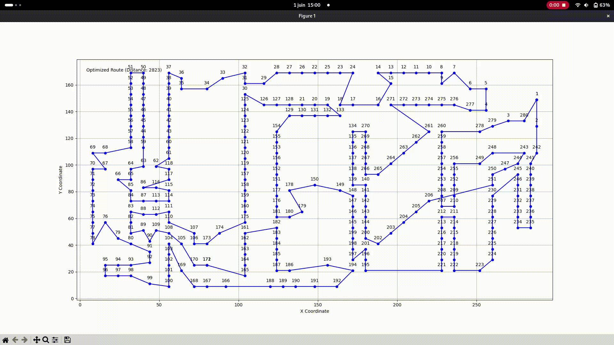

# DeliveryOptimizer (Traveling Salesman Problem - TSP)

## Overview

DeliveryOptimizer is a tool designed to solve the Traveling Salesman Problem (TSP) using various algorithms, including Nearest Neighbor with 2-opt optimization, Genetic Algorithm, and Brute Force. The tool supports manual placement of points and visualization of the optimized route.


## Features

- **Manual Point Placement**: Allows users to manually place points on a grid.
- **Algorithms**: Supports Nearest Neighbor with 2-opt optimization, Genetic Algorithm, and Brute Force (available only for manually placed points).
- **Visualization**: Provides animated visualization of the route optimization process.
- **Customizable Parameters**: Allows users to set parameters for Genetic Algorithm.

## Installation

1. **Install the required dependencies**:

    ```bash
    pip install -r requirements.txt
    ```

2. **Build the C++ extension**:

    ```bash
    make
    ```

## Usage

1. **Run the main script**:

    ```bash
    make run
    ```

2. **Follow the on-screen prompts**:
    - Choose whether to place points manually or use a pre-defined dataset.
    - Select the algorithm to solve TSP (Nearest Neighbor with 2-opt optimization, Genetic Algorithm, or Brute Force).
    - If using the Genetic Algorithm, input the population size, number of generations, crossover rate, and mutation rate.

## Examples

### Manual Point Placement

1. **Run the main script**:

    ```bash
    make run
    ```

2. **Choose to place points manually**:

    ```text
    Do you want to place points manually? (yes/no): yes
    ```

3. **Place points on the grid**:
    - Click on the plot to place points.
    - Close the window when done.

4. **Choose the algorithm to solve TSP**:

    ```text
    Choose algorithm to solve TSP:
    1. Nearest Neighbor with 2-opt optimization
    2. Genetic Algorithm
    3. Brute Force
    ```

### Using a Pre-defined Dataset

1. **Run the main script**:

    ```bash
    make run
    ```

2. **Choose to use a pre-defined dataset**:

    ```text
    Do you want to place points manually? (yes/no): no
    ```

3. **Enter the dataset file name**:

    ```text
    Enter the TSP dataset file name (e.g., att48.tsp):
    ```

4. **Choose the algorithm to solve TSP**:

    ```text
    Choose algorithm to solve TSP:
    1. Nearest Neighbor with 2-opt optimization
    2. Genetic Algorithm
    ```

---

## Visualization

- The optimized route will be displayed in an animated plot.
- For the Genetic Algorithm, the animation speed is increased for faster viewing.



## Tests

- **Run the tests**:

    ```bash
    make test
    ```

## Known optimial for each dataset

| Set Name | Known Optimal
|----------|---------------
| att48 | 33523.71
| kroD100 | 21294.29
| a280 | 2586.77

## License

This project is licensed under the Unlicense. You are free to do whatever you want with this project. See the LICENSE file for more details.
